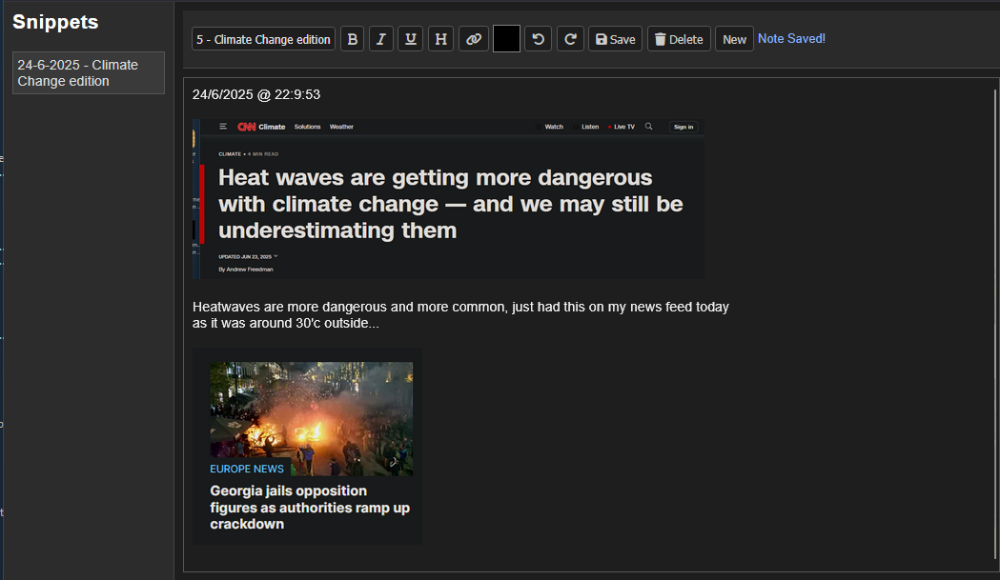

# SnipLog — Simple Note & Screenshot Saver



SnipLog is a lightweight web app for quickly saving text snippets, screenshots (including WebP images), links, and notes — perfect for clipping news, ideas, or research in one place.

## Features

-   Create, edit, delete snippets with rich text formatting (bold, italic, headings, links).
-   Paste images directly from clipboard (supports WebP and other image formats).
-   Automatically scales pasted images for better display.
-   Sidebar with scrollable snippet list for easy navigation.
-   Keyboard shortcut: Ctrl+S to save notes quickly.

## How to run

1. Make sure you have [Go](https://golang.org/dl/) installed.
2. Run the server:

```bash
go run main.go
```

3. Go to [Localhost](http://localhost:8081)
